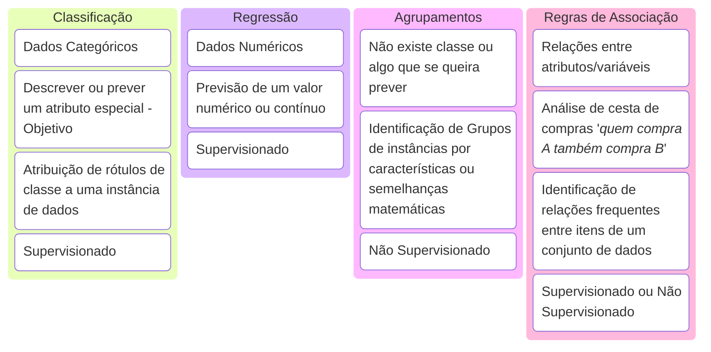

# [🔙](../README.md) Fundamentos

## Tipos de Aprendizado de Máquina

<!-- https://mermaid.js.org/syntax/kanban.html -->

## Outros Tipos de Aprendizados de Máquina:
- Deteccção de Anomalias
- Aprendizado por reforço: aprendizado por tentativa e erro
- Processamento de Linguagem Natural (NLP)
- Redes Neurais [*]
    - usadas para classificação, regressão, agrupamentos e regras de associação
- Redução de dimensionalidade / Seleção de recursos
- Aprendizado semisupervisionado: Meio caminho entre Classificação e Agrupamento

## Árvore de Decisão  

A árvore de decisão é um algoritmo de aprendizado de máquina que pode ser usado tanto para regressão quanto para classificação.

Classificação

Árvore de Decisão para Classificação: Utilizada para prever uma classe ou categoria. Cada nó da árvore representa uma decisão baseada em um atributo, e cada ramo representa o resultado dessa decisão. As folhas da árvore representam as classes finais.
Exemplo: Determinar se um e-mail é spam ou não spam.

Regressão

Árvore de Decisão para Regressão: Utilizada para prever um valor contínuo. Similar à árvore de decisão para classificação, mas as folhas da árvore representam valores numéricos.
Exemplo: Prever o preço de uma casa com base em suas características.

