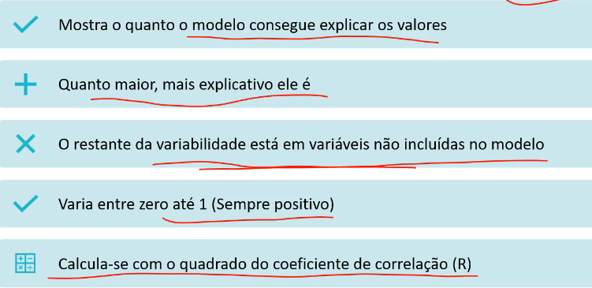
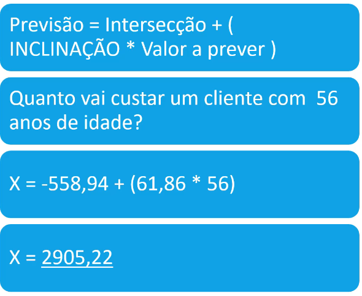

# Algorítimo de Regressão

## Variáveis

Independetes ou exploratória: é a variável que explica o que queremos prever.
Dependentes: é o que queremos prever.

Na regressão linear supoe que existe uma certa linearidade (não perfeita) entre os valores. Matemática diz que pode ser criado uma linha que se encaixe nos pontos (melhor ajuste). O modelo busca uma generalização.

## Correlação $R$
- Mostra a força e a direção da relação entre as variáveis.
- Poder ser um valor entre -1 e 1.
- A Correlação de A~B é a mesma que B~A.

Relação positiva como a do exemplo, maior idade mais caro. Ou relação negativa, como temperatura baixa aumenta o numero de vendas de casacos.

## Coeficiente de Determinação $R^2$

Significa que 86% pode ser explicada pela variável Idade, mas 14% são explicadas por variáveis não presentes no modelo.

## Como a linha é construída?

Regra de linear. ax + b = y.

## Como prever?

## Zoom

Observe que os pontos podem não bater com a linha. Há resíduos de erros. Acima são erros positivos e abaixo da linha são erros negativos.

## Tipos de Regressão

- **Simples**: Uma variável explanatória para prever uma variável dependente. 
$$Y\sim X$$

- **Múltipla**: Duas ou mais variáveis explanatórias para para prever uma variável dependente. 
    $$Y\sim X1 + X2 + X3 + ...$$

## Condições de Regressão simples

Não se pode fazer regressão sem considerar algumas condições mínimas para isso.

- Correlação: Moderada/Forte.
- Coficiente de determinação $R^2$: 
    - $R^2 \geq 0.7$ - Bom desempenho.	
    - Entre eles: Precisa ser avaliado
    - $0 \leq R^2 \leq 0.3 $ - Ruim desempenho.

- Residuais proximos de uma distribuição normal. 
    - Histogramas
    - Diagrama de normalidade (Normal Q-Q Plot)
    - Teste de normalidade (Shapiro-Wilk)

## Condições de Regressão múltiplas

- Analisar cada variável independente com $Y$ individualmente
- Gerar gráficos de dispersão individuais
- Buscar redundências (mesmos efeitos de $X$ sobre $Y$)
- Linearidade entre a variável dependente e as variáveis independentes

- Coficiente de determinação $R^2$:
    - Lembrando que o $R^2$ é o percentual de variação da variável de resposta que é explicada pelo modelo.
    - Quando se colocam mais variáveis no modelo, a tendéncia é de aumentar o $R^2$, mesmo que a adição de variáveis nao aumente a qualidade/precisão do modelo.
    - Deve-se utilizar o $R^2_{ajustado}$` , que ajusta a variação do modelo de acordo com o número de variáveis independentes incluídas no modelo.
    - O $R^2_{ajustado}$ var ser sempre menor que o $R^2$.

- Colinearidade:
    - Correlação forte entre variáveis independentes.
    - Multicolinearidade: correção entre as variáveis independentes
    - Incluir variáveis independentes colineares pode prejudicar o modelo, criando previsões erradas.
    - Pouca ou nenhuma colinearidade;
    - Solução: Excluir um dos atributos ou combinar colunas binárias.

- Parcimônia:
    - Não colocaor variáveis que não melhorem o modelo em nada. Criar modelos parcimoniosos.

- Resíduos:
    - próximos a distribuição normal
    - variância constante em relação a linha de melhor ajuste
    - Independentes (sem padrão)

- Uso de Correlograma é sugestiva.

## Cálculos

### Correlação $r$

Pearson é a mais comum.

> Valor próxima de 1 (bem forte) e positiva

### Inclinação $m$

$S_y$ e $S_x$ são desvios padrão de $Y$ e $X$ respectivamente.

### Interceptação $b$

### Previsão $p$

$$p = b + (m * v)$$

