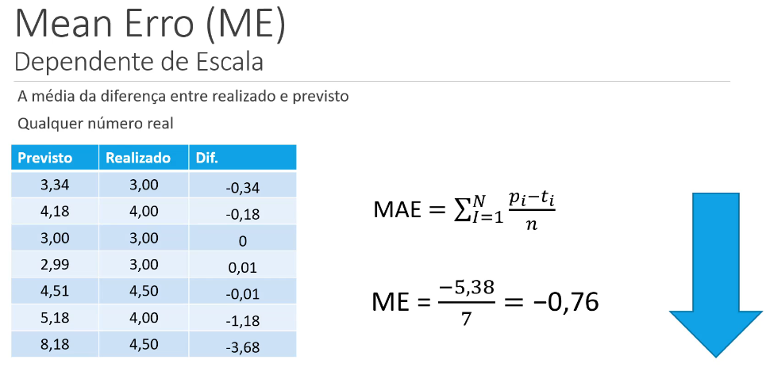
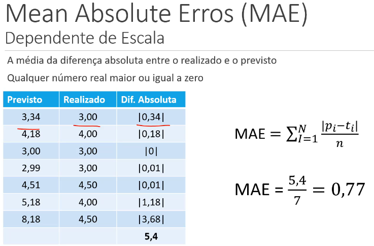
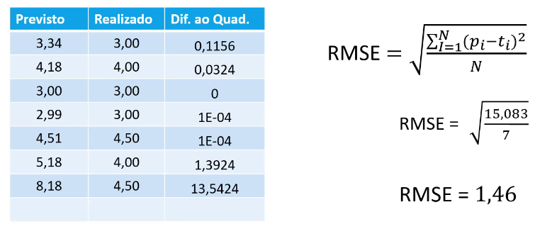
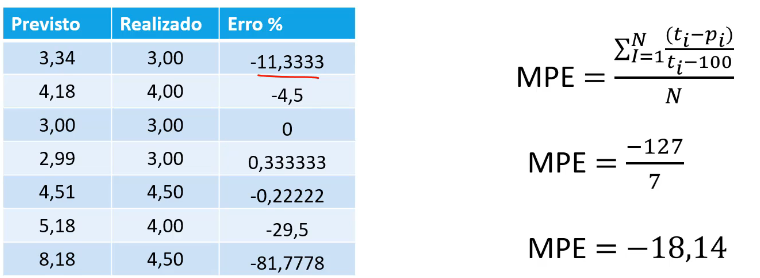
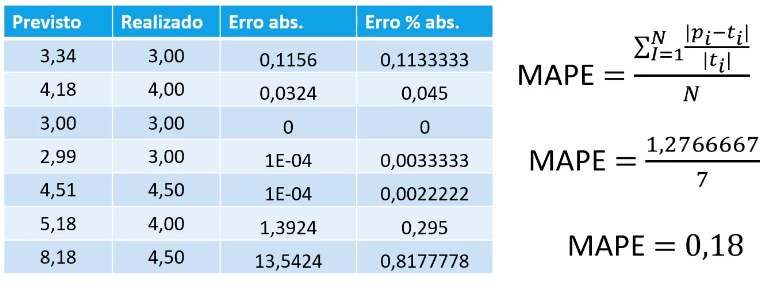

# [🔙](../../README.md) Regressão

## Métricas para Regressão

### Mean Error (ME) - Erro Médio - [wikipedia](https://en.wikipedia.org/wiki/Mean_error)

$$ME =\frac{1}{n} \sum_{i=1}^n (y_i - \hat{y}_i)$$

Depende da escala: Vai ser influenciado pela amplitude/grandeza dos valores. O resultado poderia ser qualquer valor $\in \mathbb{R}$.

Média da somatória de todos os erros. 

> Não é uma boa métrica, pois ele está sujeito erros positivos e negativos estarem se anulando. O resultado pode ser qualquer valor $\in \mathbb{R}{\geq 0}$.

### Mean Absolute Error (MAE) - Erro Absoluto Médio - [wikipedia](https://en.wikipedia.org/wiki/Mean_absolute_error)

$$MAE =\frac{1}{n} \sum_{i=1}^n |y_i - \hat{y}_i|$$

Corrige os problemas dos valores negativos anularem valores positivos.

> Ele depende de escala, números grandes médias grandes, números pequenos médias pequenas.

### Mean Squared Error (MSE) - Erro Quadrático Médio - [wikipedia](https://en.wikipedia.org/wiki/Mean_squared_error)

$$MSE =\frac{1}{n} \sum_{i=1}^n (y_i - \hat{y}_i)^2$$

Não é influenciado pela escala.

Interpretação:
- A unidade do MSE é o quadrado da unidade dos valores observados, o que pode dificultar a interpretação direta.
- É sensível a outliers, pois os erros são elevados ao quadrado.

### Root Mean Squared Error (RMSE) - Raiz do Erro Quadrático Médio - [wikipedia](https://en.wikipedia.org/wiki/Mean_squared_error)

$$RMSE =\sqrt{\frac{1}{n} \sum_{i=1}^n (y_i - \hat{y}_i)^2} = \sqrt{MSE}$$

Não é influenciado pela escala. É o cálculo do desvio padrão entre os valores observados e previstos.  O resultado pode ser qualquer valor $\in \mathbb{R}{\geq 0}$.

Interpretação:
- Baixo RMSE: Indica que o modelo tem um bom desempenho, pois os valores previstos estão próximos dos valores observados.
- Alto RMSE: Indica que o modelo tem um desempenho ruim, pois os valores previstos estão distantes dos valores observados.

Propriedades:
- Sensível a Outliers: Como o RMSE envolve a elevação ao quadrado das diferenças, ele é mais sensível a grandes erros (outliers) do que outras métricas como o MAE (Mean Absolute Error).
- Mesma Unidade: O RMSE tem a mesma unidade dos valores observados, o que facilita a interpretação.

### Mean Percentage Error (MPE) - Erro Percentual Médio - [wikipedia](https://en.wikipedia.org/wiki/Mean_percentage_error)

$$MPE=\frac{100\%}{n} \sum_{i=1}^n \frac{y_i - \hat{y}_i}{y_i} = \frac{1}{n} \sum_{i=1}^n \frac{(y_i - \hat{y}_i)}{(y_i-100)}$$

Diferença percentual do erro. Realizado menos o previsto. Mas tem o problema de ser influenciado pela escala (valores negativos anulam valores positivos).

### Mean Absolute Percentage Error (MAPE) - Erro Absoluto Percentual Médio - [wikipedia](https://en.wikipedia.org/wiki/Mean_absolute_percentage_error)

$$MAPE =\frac{1}{n} \sum_{i=1}^n \frac{|y_i - \hat{y}_i|}{|y_i|}$$

Interpretação:
- Valores Baixos de MAPE: Indicam que o modelo tem um bom desempenho, pois os valores previstos estão próximos dos valores observados em termos percentuais.
- Valores Altos de MAPE: Indicam que o modelo tem um desempenho ruim, pois os valores previstos estão distantes dos valores observados em termos percentuais.

Propriedades:
- Escala Relativa: O MAPE é uma métrica relativa, o que significa que é independente da escala dos dados.
- Fácil Interpretação: O MAPE é expresso como uma porcentagem, o que facilita a interpretação dos erros em termos percentuais.
- Sensível a Valores Próximos de Zero: O MAPE pode ser influenciado por valores observados próximos de zero, o que pode resultar em valores de erro muito altos.

## Outras Métricas

### AIC
Quanto menos o AIC, melhor o modelo. Tem haver com performance.

### BIC

Quanto menos o BIC, melhor o modelo. Tem haver com performance.