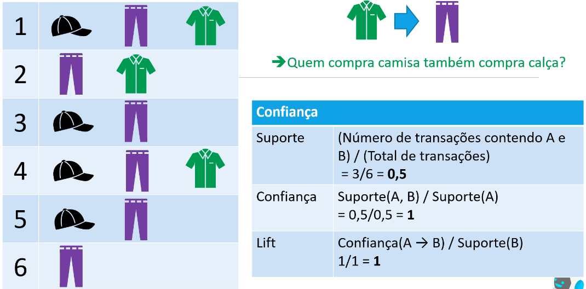
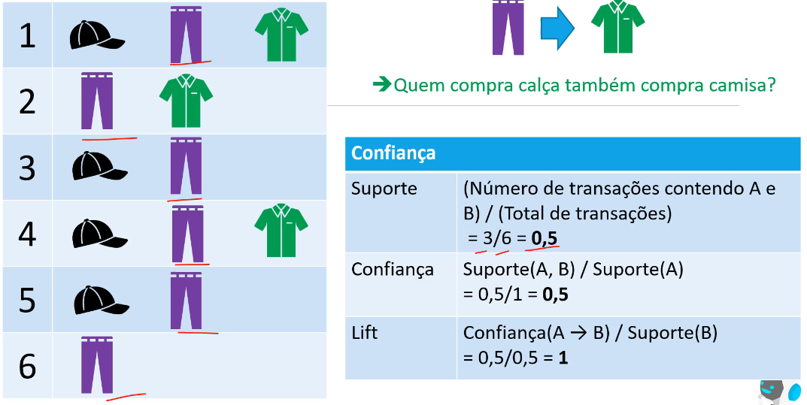
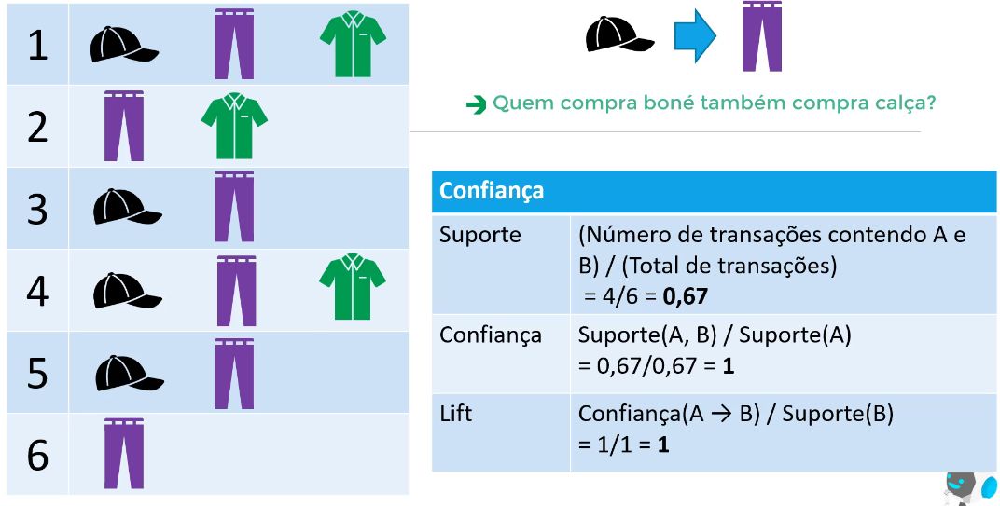

# [🔙](../../README.md) Associação

Busca relação entre itens.

Aplicações:
- Cesta de compras (mineração de regras de compra, para sugerir produtos)
- Detecção de Intrusão
- Análise de avaliações de consumidores
- Diagnóstico médico

## Métricas:

### Suporte

Quantidade de vezes (frequência) que um item aparece em uma transação. Número transações que contém todos os itens da transação.

$$Suporte(A) = \left(\frac{\text{Numero de transações que contém A}}{\text{Total de transações}}\right)$$

$$Suporte(A,B) = \left(\frac{\text{Numero de transações que contendo A e B}}{\text{Total de transações}}\right)$$

### Confiança
Indica a proporção de vezes que em uma transação contendo o elemento A, também haverá o elemento B.

$$\text{Confiança}(A \rightarrow B) = \left(\frac{Suporte(A, B)}{Suporte(A)}\right)$$

### Força da Regra (Lift)
Mostra se a associação entre os itens é positiva ou negativa.

- `$Lift=1$`: Indica que A e B são independentes, ou seja, a presença de A não afeta a probabilidade de B de ser comprado;
- `$Lift>1$`: Indica uma associação positiva entre A e B, ou seja, a presença de A aumenta a probabilidade de B de ser comprado;
- `$Lift<1$`: Indica uma associação negativa entre A e B, ou seja, a presença de A diminui a probabilidade de B de ser comprado.

$$\text{Lift}(A \rightarrow B) = \left(\frac{\text{Confiança}(A \rightarrow B)}{Suporte(B)}\right)$$

Exemplo Caso 1:
- confiança, quem compra a camisa tem 100% de confiança de comprar calça.

Exemplo Caso 2:
- Ordem invertida não afeta o suporte
- A cofiança agora é 50%, ou seja, quem compra calça tem 50% de confiança de comprar camiseta.

Exemplo caso 3:
 - cofiança de quem compra boné também compra calça

## Algorítmos

### Apriori e FP-Growth

São os mais comuyns usados na mineração de regras de associação.

#### Apriori  
    
Baseado no princípio de que se um conjunto de itens é frequente, um subconjunto destes itens também será frequente. O princípio contrário também é válido.

#### FP-Growth

Induz árvores, e busca sobreposição destas árvores, onde os itens são frequêntes.