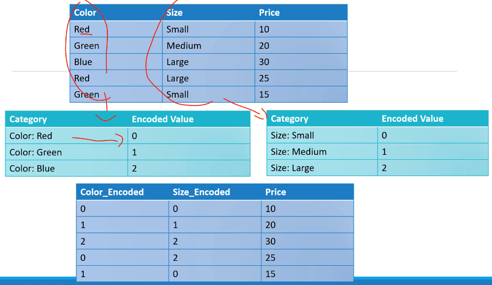
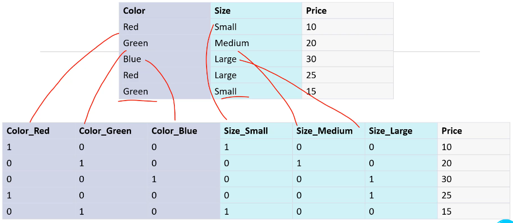
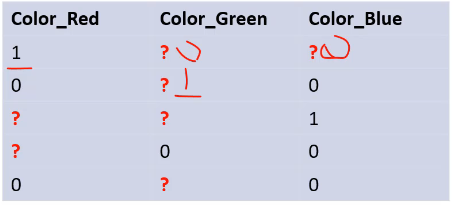
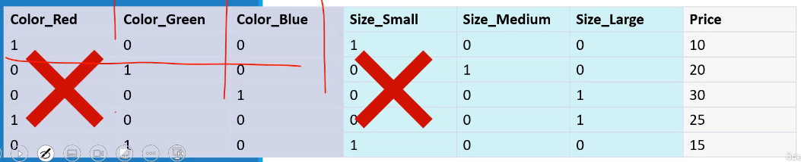
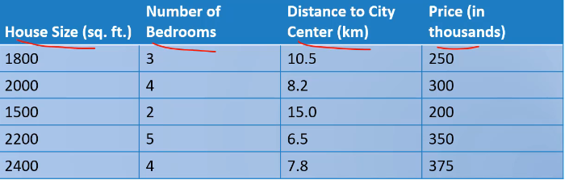
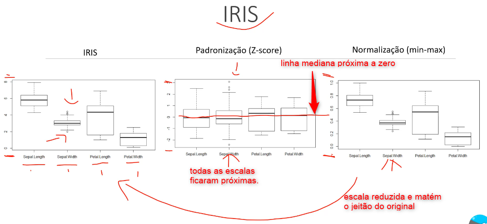

# [🔙](../../README.md) Preparação de Dados

## Categoral Encoding

Transformar categorias em números.

### Label Encoding

Usada quando há ordem, grande número de categorias (não dá para usar One-hot Encoding).

Cada categoria recebe um número, ou seja, a primeira categoria recebe 0, a segunda 1 e assim por diante. Geralmente em ordem alfabetica.

Pontos Fraco:
- Problema de interpretação de ordem de grandeza. Pequeno, Médio e Grande tem ordem de grandeza, mas cores vermelho, verde e azul não tem. Pode gerar problema para o classificador.

Pontos Forte:
- Faixa de valores finitas.
- Faixa de valores discretas.

### One-Hot Encoding

Usada o número de categorias é pequeno e não há ordem.

Cada categoria é transformada em outro atributo: **Dummy variable**.

Um valor binário informa a ocorrência.

Pontos Fraco:
- Muitas colunas podem gerar um espaço de características muito grande (alta dimensão). Pode causar um super ajuste e ter alto custo computacional.
- Maldição da dimensionalidade: Dados esparços, muitas colunas com valore zero. Dificil encontrar valor de interesse.
- Dummy variable Trap: Valores de colunas binárias podem ser previstos a partr dos valores de outras colunas. Tipo, dá para deduzir os valores onde tem interrogação na imagem.

    
    - Valor de atributos altamente previsíveis.
    - Multicolinearidade: correção entre as variáveis independentes
    - A solução é excluir um dos atributos ou combinar colunas binárias.
    

## Dimensionamento de Características (Feature Scaling)

Processo de tranformação de dados numéricos. 

Observe no exemplo que cada atributo esta em uma escala (unidade, dezena, centena, etc.). Elas vão contribuir de forma desbalanceada no modelo.

Permite no Gradient Descent convergencia mais rápida para ao mínimo local.

Veja a comparação dos metodos no clássico problema da IRIS.

Observações:
- Não vai nencessariamente melhorar o modelo, dependendo do problema;
- Arvores de decisão não de precisam de nenhum tipo de dimensionamento de características;
- Não se aplica a atributos categóricos já transformados (ex. one-hot encoding).

### Padronização (Z-Score)

Normaliza os dados para ter media 0 e variancia 1.

$$X_p = \frac{X - \mu}{\sigma}$$

- Dados aproximado da media zero e desvio padrão 1 (próximos de uma distribuição normal);
- Podem ser negativos;
- Não afeta outliers;
- Deve ser usado na maioria dos casos.

### Normalização (Min-Max)

Normaliza os dados para ter min 0 e max 1.

$$X_p = \frac{X - min(X)}{max(X) - min(X)}$$

- Transforma para escala comum entre zero e 1;
- usado em processamento de imagens e RNA;
- Quando não sabemos a distribuição dos dados;
- Quando precisam ser positivos;
- Algorítimos não "requerem" dados normais;
- Remove outliers pois impões "limites".

## Normalization