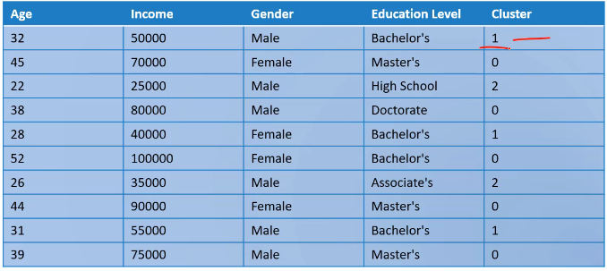
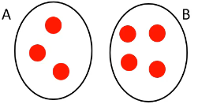
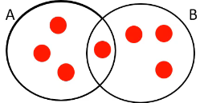
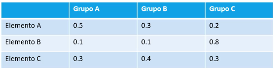
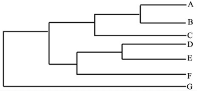
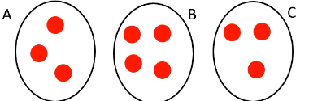
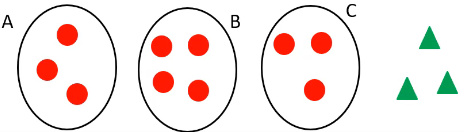

# [🔙](../../README.md) Agrupamentos (Clusters)

O Objetivo é criar grupos a parti de atributos (características) que possuem semelhanças matemáticas. Não existe classe e são tarefas não supervisionadas.

Exemplos de uso:
- Dividir clientes em diferentes segmentos
- Reconhecimento de comunidades em análises de redes sociais
- Divisão de imagem em diferentes segmentos
- Detecção de anomalias em dados
- Combate ao crime: identificação de regiões com maior incidência.

## Tipos
- Agrupamento completo: Cada elemento pertence a um grupo.

    

- Agrupamento parcial: Cada elemento pode pertencer a mais de um grupo.

    

- Modelo difuso: Cada elemento pertence a um grupo segundo uma probabilidade.

    

- Modelo hierárquico: permite que o grupo tenha subgrupos.
    

- Agrupa todos os elementos.

    

- Pode deixar elementos sem agrupar (ruído).

    

## Algoritmos

### K-Means e K-Medoids

Mais popular, versátil, simples e fácil de implementar.

- baseado em protótipos (pontos iniciais onde começa o agrupamento)
- encontrar um número de grupos definidos pelo usuário
- agrupa todos os objetos (não produz ruído)
- definir os centroides é uma etapa fundamental
- distância euclidiana

#### K-means
- Protótipo é um centróide: média de grupo de pontos
- Quase nunca é um ponto real de dados

#### K-Medoids
- protótipo baseado em um medóide: ponto mais representativo
- é um ponto real de dados

#### Pontos fracos k-means e k-medoids:
- tem dificuldade para detectar grupos naturias, não esféricas, de tamanho ou densidades muito diferentes.
- Restrito a dados que exista uma noção de centro;
- Pode ser melhorado escolhendo o centro dos pontos

### DBSCAN

- baseado em densidade
- menos afetado por ruídos
- número de grupos definidos automaticamente
- pontos de baixa densidade são definidos como ruídos e não agrupados
- a densidade é baseada no raio especificado. Um ponto pode estar no interior, no limite da borda ou sem classificação (ruído)
- Não é bom em grupo cujas densidades variam muito.

### Hierarquico

- **Aglomerativa**: comela com pontos em grupos individuais e a cada etapa funde os pares mais próximos. Requer uma noção de proximidade. Mais comuns.
- **Divisiva**: divide os pontos em grupos e a cada etapa divide os grupos mais proximos. A cada etapa divide até que reste apenas grupos únicos.

Usa dendogramas para exibir os grupos.

