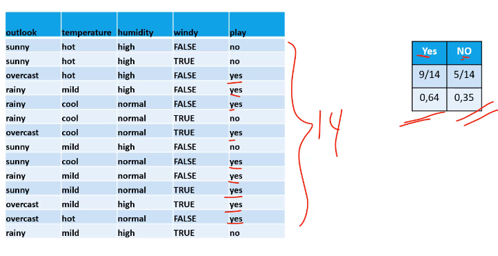
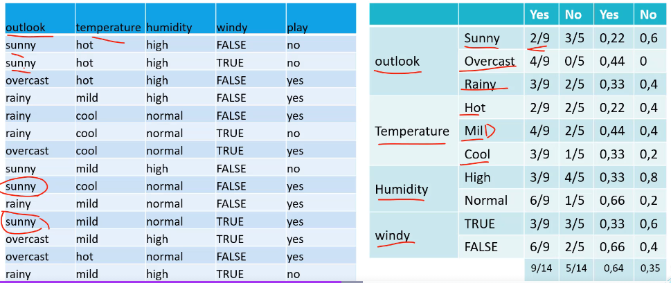
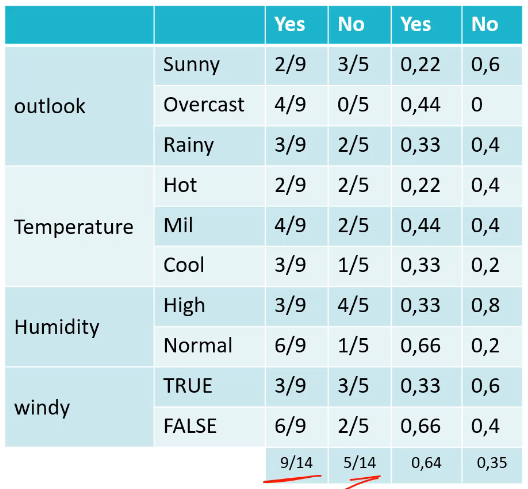
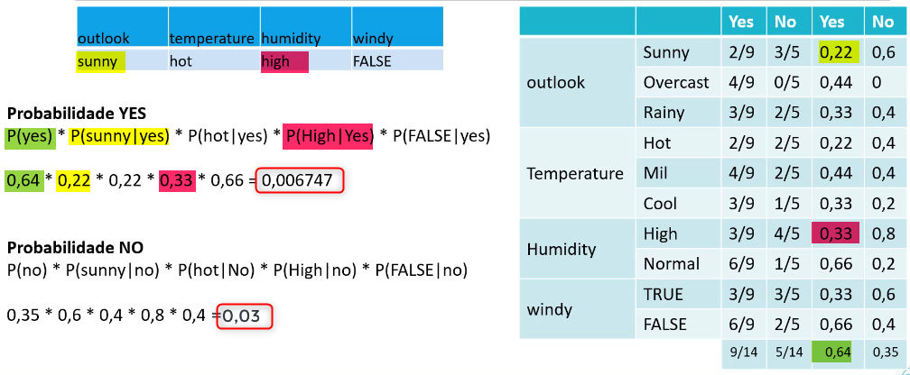
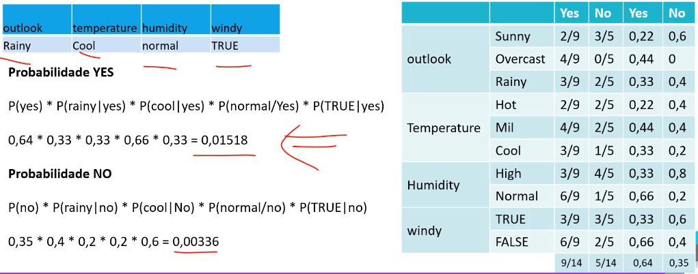

# [🔙](../../README.md) Algorítimo de Classificação

A Proposta do Bayes é propor uma probabilidade de ocorrencia de um fato.
- Se eu jogar uma moeda existe uma probabilidade de dar cara;
- Se eu jogo um dado, existe uma probabilidade de cair o número 3.

Como faz isso?

Olha os dados histórica e determina a probabilidade de um resultado acontecer influenciada pelos atributos.

Duas formas mais conhecidas, Naive Bayes e Redes Baysianas.

## Naive Bayes

Adota como premissa que não há condicionamento entre as variáveis. Embora no mundo exista condicionamento, ele ignora ele (ex. temperatura e humidade tem correlação para chuva, um influencia o outro).

Assume que todas as variáveis (atributos) são independentes entre si, dado a classe. Esta é uma suposição forte e muitas vezes irrealista, mas simplifica muito os cálculos.

Observe no exemplo que há 14 ocorrências, onde $\frac{9}{14}$ foram $\text{YES}$ e $\frac{5}{14}$ foram $\text{NO}$.

Agora calcular a probabilidade dos atributos com a classe. Observe o caso de Outlook Sunny, onde tivemos total de 5 ocorrencias, sendo 2 delas no $\text{YES}$ e 3 delas no $\text{NO}$, ou seja, $\frac{2\text{ Sunny}}{9 \text{ YES}}$ e $\frac{3\text{ Sunny}}{5 \text{ NO}}$.

A Somatória contribuinte de cada atributo (outlook, temperature, humidity, windy) deve ser de 1.

O modelo final será...

Faz-se o cálculo da probabilidade posterior para cada classe. Se a probabilidade posterior for maior que 0.5, ele classifica como $\text{YES}$, se menor, ele classifica como $\text{NO}$.

### Caso 1:

Ha probabilidade do exemplo maior é do $\text{NO}$, portanto, NÃO vai poder jogar.

### Case 2:
Ha probabilidade do exemplo maior é do $\text{YES}$, portanto, vai SIM poder jogar.

Observe que o modelo criou uma generalização, mas esta ocorrência histórica foi de que Não jogou. O modelo não errou, pois ele buscou uma generalização dentro que aprendeu.

### O que fazer com valores contínuos?	

- Discretização dos atributos contínuos.
    - Ex: Transformar idade em Crianca, Adolescente, Adulto, Idoso.

- Converter na probabilidade segundo distribuição normal Gaussian Naive Bayes.

## Redes Baysianas

