# [🔙](../../README.md) Classificação

## Medir o Desempenho do Modelo

- **Treino**: Dados usados para <u>criar um modelo</u>.
- **Validação**: Dados usados para <u>ajustar o modelo</u>.
- **Teste**: Dados usados para <u>avaliar o desempenho/performance do modelo</u>.

## Generalização X Super Ajustes X Sub Ajuste

- **Genérico**: Modelo ideal, performance semelhante ao ambiente desenvolvimento e no de produção. 
- **Super Ajuste**: Modelo que se ajusta muito bem aos dados de treinamento, mas falha em generalizar dados de produção (ex. teste acerta 90% e na produção acerta 60%).
    - Tamanho insuficiente de dados de treinamento;
    - complexidade excessiva do modelo de treinamento;
    - Dados de treinamento muito diferentes do ambiente de produção (ruídos nos dados);
    - Seleção inadequada de características (ex. se tenho 20 atributos, tenho que usar todos eles);
    - Falta da validação cruzada.

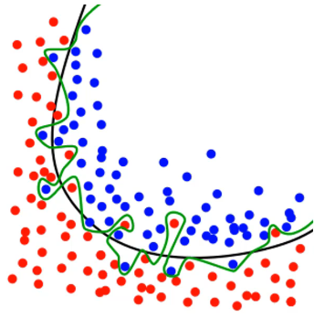
- **Sub Ajuste**: Modelo não consegue se ajustar bem aos dados de treinamento, e falha em generalizar dados de produção (ex. Não aprende o padrão dos dados).
    - Modelo muito simples;
    - Conjunto de dados muito pequeno;
    - Seleção inadequada de características;
    - Falta de ajuste de hiperparâmetros.

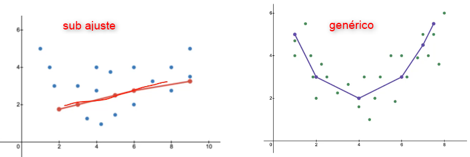

## Tecnicas de Validação
### Hold-Out
Típo de técnica mais comum usada para avaliar a performance de um modelo de aprendizado de máquina, divide os dados em treino e teste.

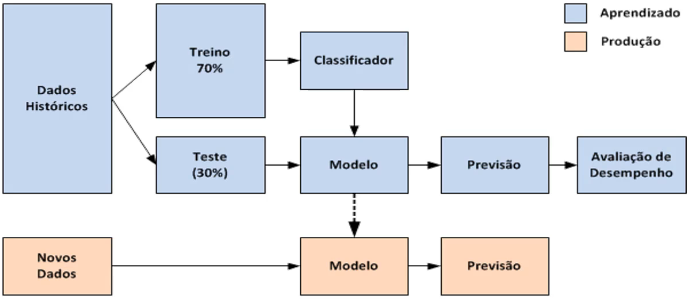

### Validação Cruzada
Divide os dados em vários conjuntos menores.
> Divido meus dados por exemplo em 10 subconjuntos, uso 1 deles para treino e os outros 9 para validação. Depois pego outro subconjunto e o uso para treino e os outros para validação. Repito o processo 10 vezes, e calculo a media das medidas de desempenho.

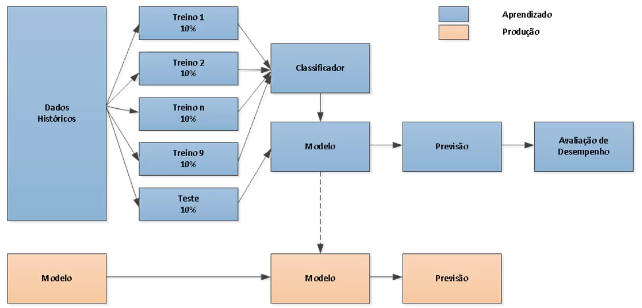

### Leave-One-Out
Tipo de validação cruzada, que treina com todos os conjuntos de dados menos um.

> Sempre vai removendo um conjunto de dados e treinando com os outros.

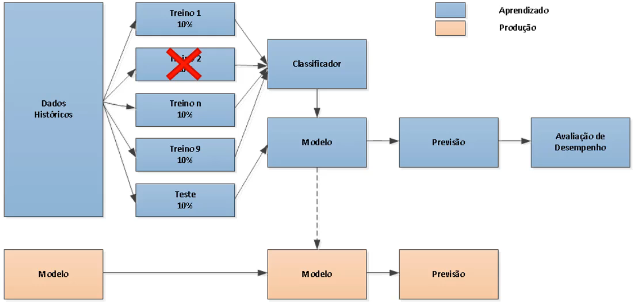

### K-Fold
Tipo de validação cruzada: Divide o conjunto de dados em k subconjuntos, treina com k-1 subconjuntos e avalia-o no subconjunto restante. Repete o processo k vezes.

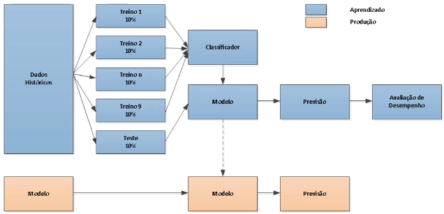

### Subamostragem
É uma técnica que envole a seleção de uma amostra aleatória de exemplo de um conjunto de dados original para treinamento ou avaliação do modelo.

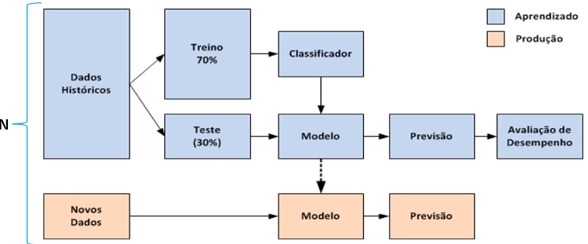

## Métricas para Classificação

Exemplo Concessão de Crédito.

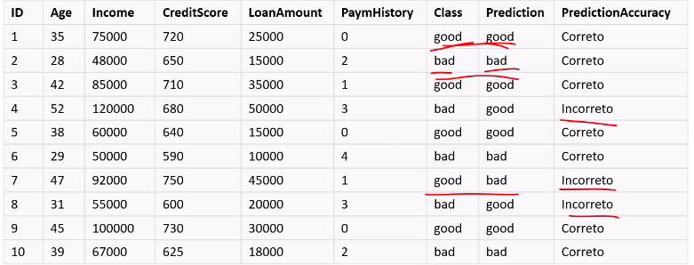

### Matriz de Confusão (primeira coisa a olhar)

Falso Positivo (FP) | Verdadeiro Negativo (VN ou TN) | Verdadeiro Positivo (VP ou TP) | Falso Negativo (FN)

    - Falso Negativo (FN): Perdeu o negócio, classificou como negativa um negócio que traria lucro. Negou empréstimo para alguem que pagaria.
    - Falso Positivo (FP): Perdeu dinheiro, classificou como positiva um negócio que gerou prejuízo. Concedeu empréstimo para alguem que não vai pagar.

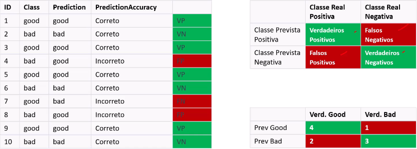

### Acurácia
Fórmula: $\left(\frac{VP + VN}{VP + VN + FP + FN}\right)$

- No exemplo acima: $\left(\frac{4 + 3}{4 + 3 + 2 + 1}\right)$ = $0.7$ ou 70% de acuracia.

> O modelo classificou corretamente 70% das instâncias.

### Precisão
Fórmula: $\left(\frac{VP}{VP + FP}\right)$

Proporção de instancia verdadeiramente positivas entre instâncias previstas como positivas. Ou seja, das instâncias previstas como positivas, quantos porcentos eram realmente positivas.

- No exemplo acima: $\left(\frac{4}{4 + 2}\right)$ = $0.67$ ou 67% de precisão.

> Das intâncias previstas como positivas, 67% eram realmente positivas. Quantidade de clientes que pagarão o empréstimo. **Busca a qualidade das precições positivas do modelo.**

### Recall
Fórmula: $\left(\frac{VP}{VP + FN}\right)$

Sensibilidade ou Taxa de Verdadeiros positivos. A proporção de instancias classificadas como positivas em relação às instâncias positivas reais.

- No exemplo acima: $\left(\frac{4}{4 + 1}\right)$ = $0.8$ ou 80% de recall.

> O modelo identificou corretamente 80% das instâncias boas. Usado para avaliar a eficácia do modelo de classificação. **O Recall se concentra na capacidade do modelo de identificar instâncias positivas.**.

### Especificidade
Fórmula: $\left(\frac{VN}{VN + FP}\right)$

Especificidade ou Taxa de Verdadeiros Negativos. A proporção de instancias classificadas como negativas em relação às instâncias negativas reais.

- No exemplo acima: $\left(\frac{3}{3 + 2}\right)$ = $0.60$ ou 60% de especificidade.

> Identificou corretamente 60% das instâncias negativas como negativas. Proporção de clientes de risco que são avaliados como tal. Eficaz na identificação de clientes que não podem pagar.

### F1-Score - [wikipedia](https://en.wikipedia.org/wiki/F-score)

Se concentra na capacidade do modelo de identificar instâncias positivas e negativas.

Fórmula: $\left(\frac{2 \times Precisao \times Recall}{Precisao + Recall}\right)$ = $\left(\frac{2 \times VP}{2 \times VP + FP + FN}\right)$ = $\left(\frac{2}{Recall^{-1} + Precisao^{-1}}\right)$

- No exemplo acima: $\left(\frac{2 \times 0.67 \times 0.8}{0.67 + 0.8}\right)$ = $0.73$

> 0.73 indica que há um equilíbrio entre precisão e recall. Métrica importante para quando os dados estão em desequilíbrios. 

### ROC Curve (Característica operacional do receptor) - [wikipedia](https://en.wikipedia.org/wiki/Receiver_operating_characteristic)

Apenas para classificação binária. Área sobre a curva

O ponto ideal na curva ROC é o canto superior esquerdo (0,1), onde a sensibilidade é máxima (1) e a taxa de falsos positivos é mínima (0). Isso indica um modelo perfeito que classifica todas as instâncias corretamente.

### Problema da Classe Rara

No caso de um modelo para detecção fraudulenta, a falta de balanceamento fará com que o modelo aprenda mais caractarísticas de detecção de transações OK. Em uma classe rara, o modelo poderá aprender a classificar todas as instâncias da classe rara como verdadeiras positivas, o que fará classificar todas as instâncias da classe rara como falsas positivas. 

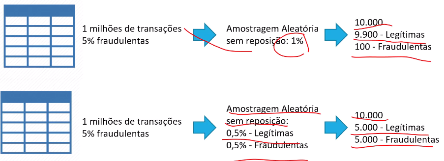

> Uma solução é balancear a amostragem com transações fraudulentas com ok.

### Não devemos somente olhar acurácia

- Caso 1: Observe o Recall.
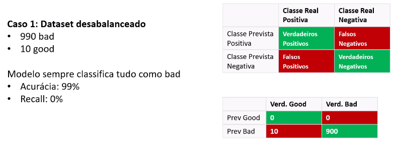

- Caso 2: Significa que doentes não estão recebendo diagnóstico, recall baixo.
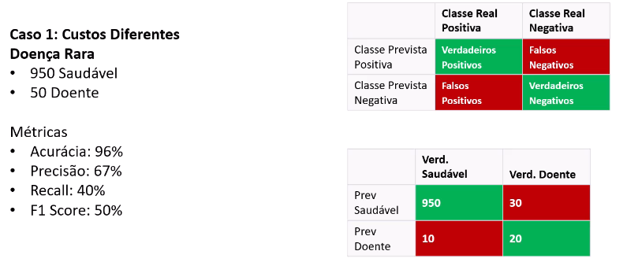

### Problema de atributos desconhecidos

> No treino do modelo tinha regiões Sul, Sudeste, Centro-Oeste e Norte, mas na produção aparece a região Nordeste (o modelo nunca ouviu falar).

