# Arvore de Decisão

Funciona como um grafo direcionado acíclico (não pode ser ciclos), onde cada nó representa uma decisão baseada em um atributo, e cada ramo representa o resultado dessa decisão. As folhas da árvore representam as classes finais.

Só pode haver um caminho para cada nó folha.

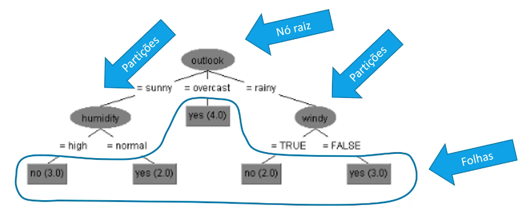

Podem ser gerados diversos tipo de árvore decisão para o mesmo dataset. Depende do algorítimo de árvore escolhido e dos hiperparametros.
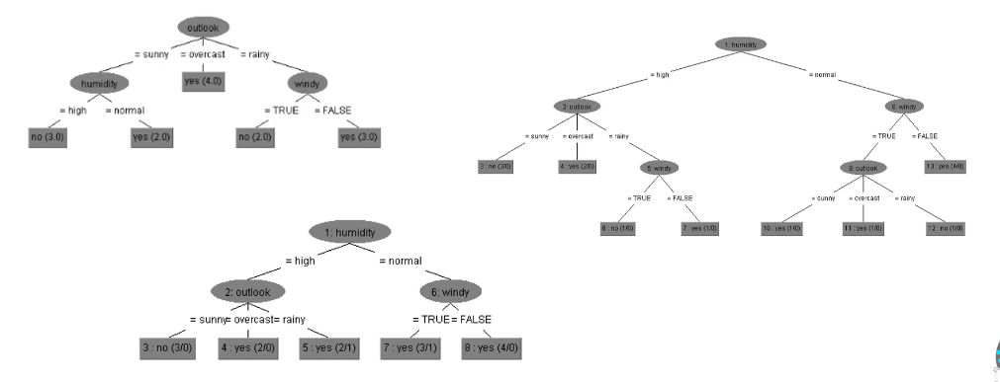

## Métricas de Complexidade

- Profundidade: número de nós da raiz até as folhas
- Largura: número de nós em cada nível

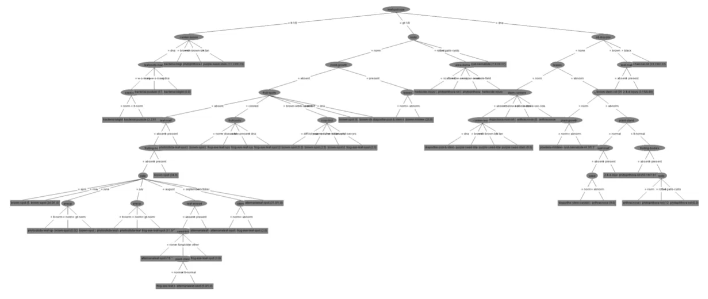

## Valores discretos ou contínuos

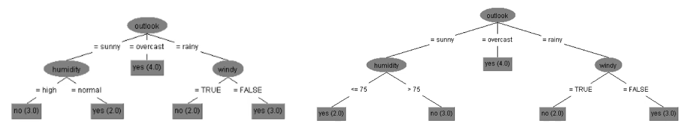

## Indução da árvore

Processo de construção da árvore.

- Divisão
    1. Em duas partes ou em n partes
    2. Binário: divisão dupla
    3. Nominal: múltiplas divisões ou agrupando atributos em sub conjuntos
    4. Contínuo: comparação de valores ou discretização (duas ou multiplas divisões)

    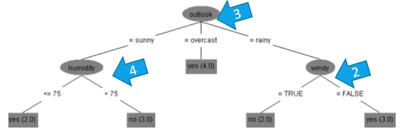

O objetivo é criar divisões mais "puras" possíveis através de uma medida de pureza.
- Gini
- Entropia
- Erro de classificação

## Condição de parada

- Quando se chega a classe pura.
- Número mínimo de observações em um nó
- A última partição não aumenta a métrica da pureza

## Poda

- Processo de reduzir o tamanho da árvore após a indução.
- Árvores muito grandes está sujeita a super ajustes (overfitting) e alto custo.
- Mecanimos
    - Checar se pares de nós podem ser fundidos, aumentando a pureza
    - Checar se partiçiões aumentam a pureza

## Como se monta uma árvore?

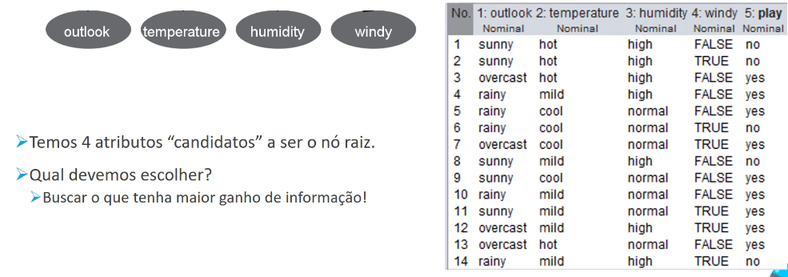

### Entropia

Teoria da Entropia:

$$E(S) =  -\sum_{i=1}^n p_i \log_2(p_i)$$

Onde:
- $S$ representa um conjunto de treino;
- $p$ representa a probabilidade de cada classe $E(S)$;
- Se todas as instâncias de $S$ pertencem a mesma classe $E(S)=0$;
- Se $S$ contém o mesmo número de instância para cada classe $E(S)=1$;

#### Cálculo da Entropia - Caso 1

Este é o cálculo de Entropia da Classe, mesmo que nao entre no moedelo.

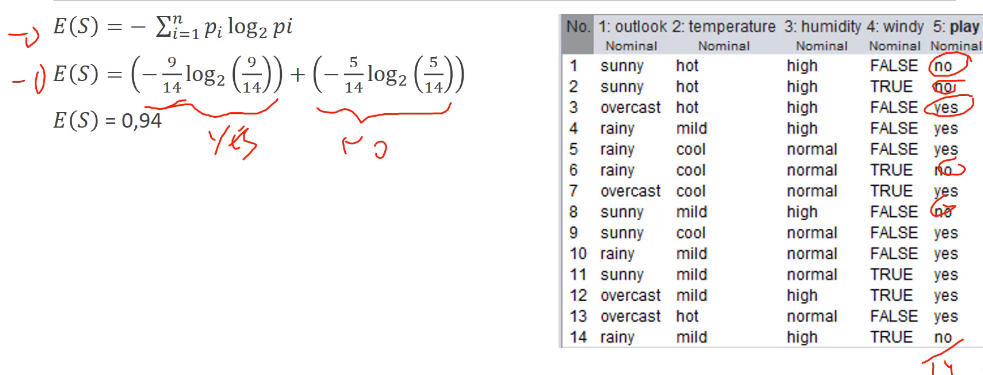
> Temos dois valores para classe $\text{YES}$ e $\text{NO}$. 
> A probabilidade de $\text{YES}$ é $9/14$ e a probabilidade de $\text{NO}$ é $5/14$. 

Cálculo de todos os outros atributos candidatos a ser raíz da árvore.
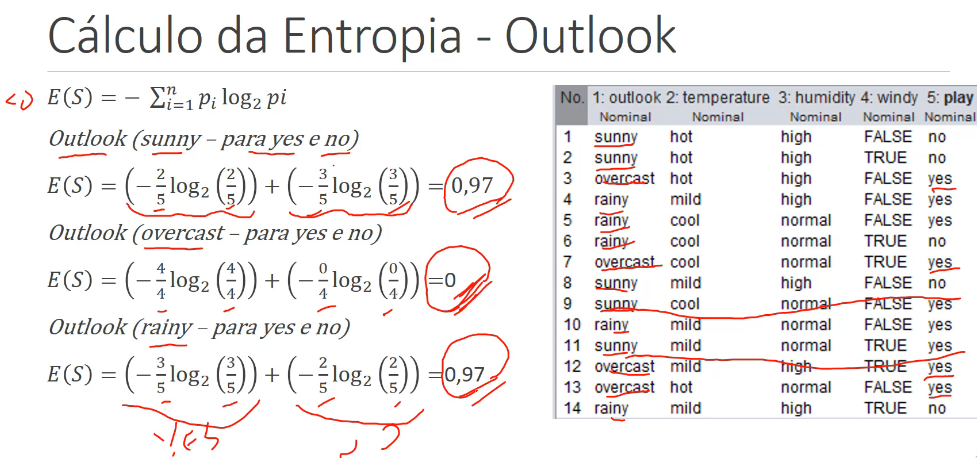

> Note que para overcast E(S) = 0, ou seja, todas as instancias pertencem a mesma classe (YES).

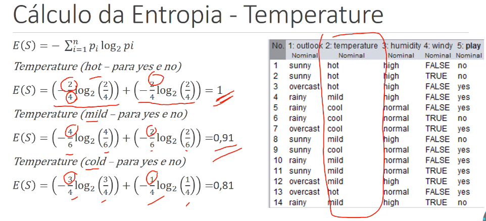

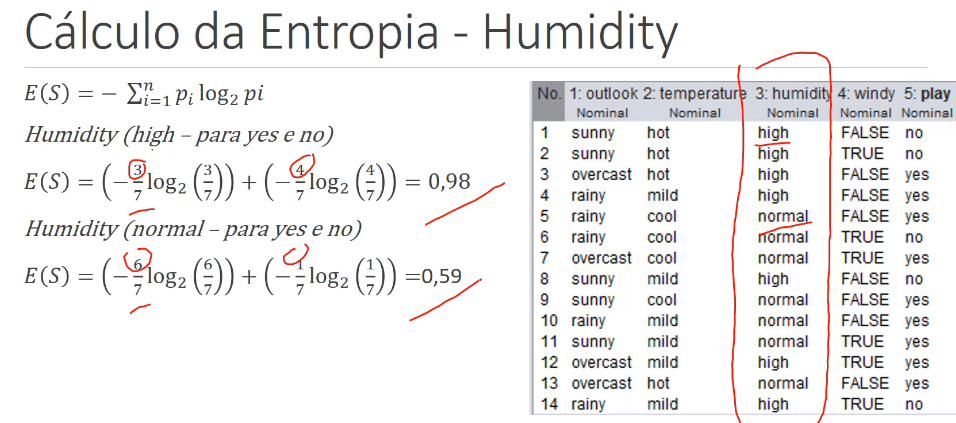

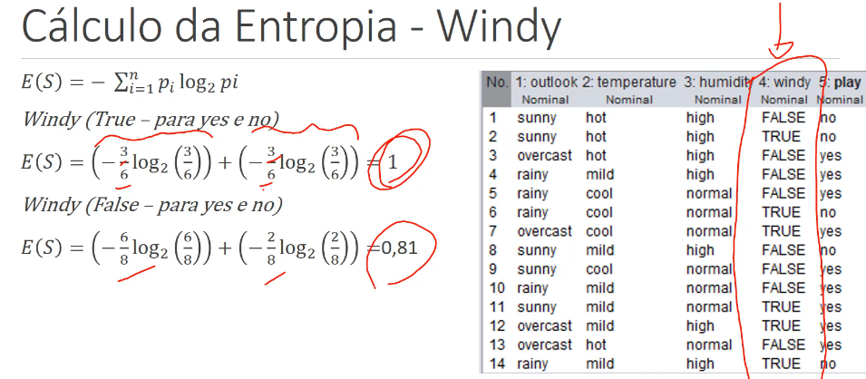

### Ganho de informação (Information Gain)

$$IG(S,A) = E(S) - \sum_{i=1}^n \frac{|S_i|}{|S|} E(S_i)$$

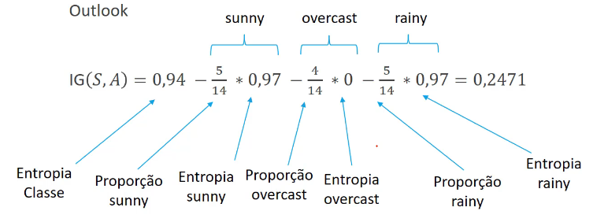

Mas preciso calcular todos os ganhos.

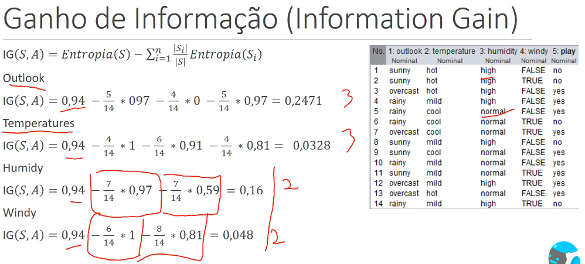

Ao comparar todos os Ganhos, nota-se que o outlook é o que tem maior ganho. Assim ele é o escolhido para node raiz.

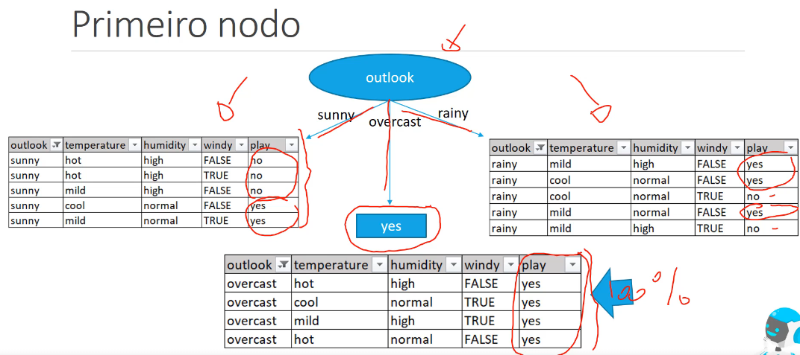

E segue calculando a entropia das subdivisões restantes. Chegamos ao segundo nó de humidade. Note que chegamos na tal pureza (yes ou no)

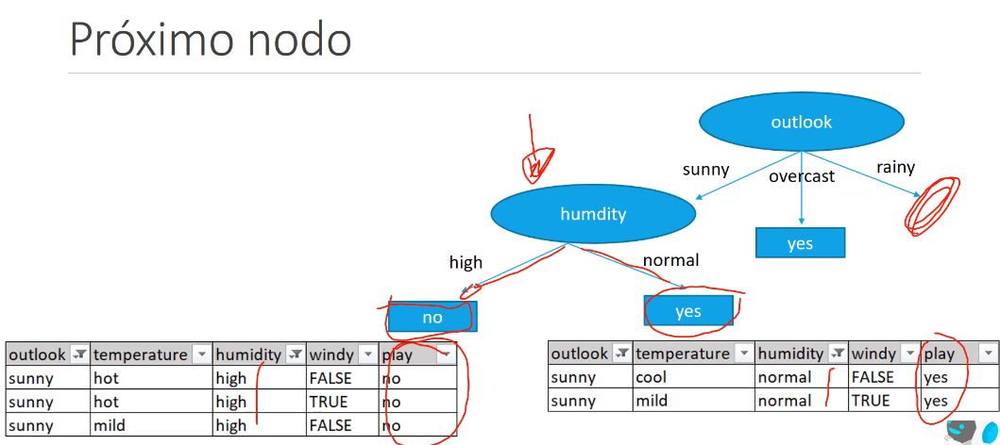

Segue o cálculo da entropia do node à direita. Desconsidera o outlook (node raiz) e humidade (node da esquerda).

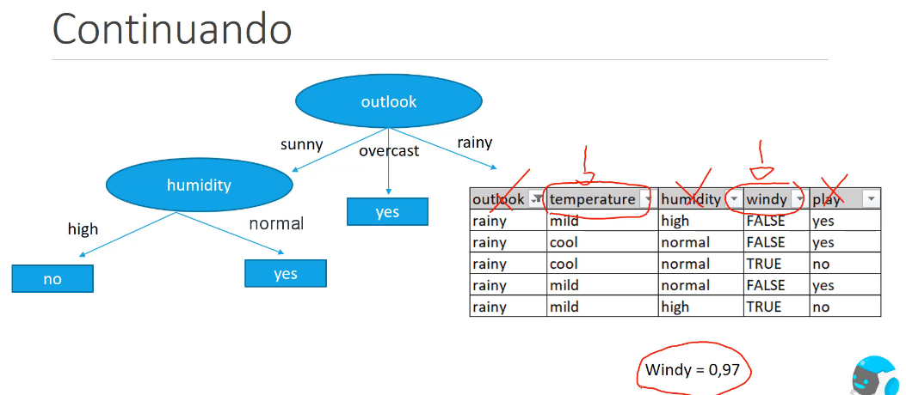

Resultado final

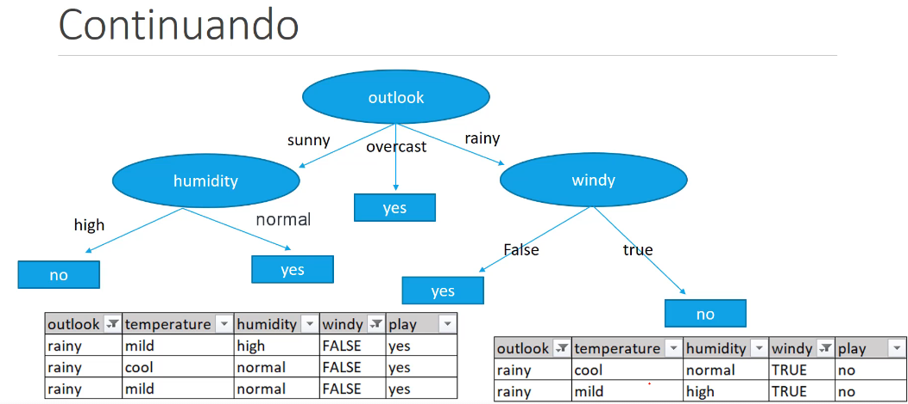